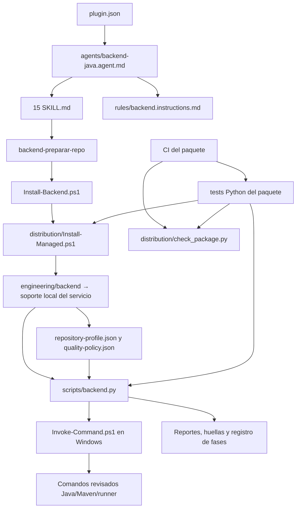

# Inventario y criticidad del agente backend

Auditoría del 3 de octubre de 2026. Fuente: contenido, referencias, instaladores,
runtime, pruebas y archivos Git del paquete; la criticidad es una evaluación de
impacto al retirar archivos, no una medición de incidentes en producción.

## Alcance y versión examinada

Se encontraron **47 archivos versionados** y **5 cachés Python ignoradas** en
`backend-copilot-agent` antes de esta auditoría. Esta entrega incorpora dos
documentos: este inventario y [AUDITORIA-WORKSPACE.md](AUDITORIA-WORKSPACE.md).
El inventario final cubre 49 fuentes/documentos y las 5 cachés observadas.
`.git/` se trata como metadata del repositorio: no es contenido del plugin y no
se enumeran sus objetos internos, referencias, hooks ni configuración privada.

**Distinción necesaria:** el árbol local examinado declara `plugin.json` **0.6.0**,
con cambios previos sin commit. Al comenzar, `main` local y remoto estaban en
`c1d7d25` (**0.5.0**). Las rutas de soporte local descritas aquí corresponden a
0.6.0. Publicar esta documentación por separado no publica esos cambios de código.
Para identificar lo realmente instalado, revisar `plugin.json` y
`installation.json`; no deducir la versión instalada del título de un documento.

La carpeta superior también contiene otro paquete, propuestas, muestras de
VS Code y archivos de distribución. Su inventario individual está en el anexo
del workspace; no son dependencias del plugin actual.

## Cómo interpretar la criticidad

| Nivel | Consecuencia de eliminarlo sin sustitución | Decisión inicial |
| --- | --- | --- |
| Crítica | Rompe descubrimiento, preparación, ejecución o cierre verificable del flujo completo | Conservar; cualquier sustitución requiere actualizar consumidores y validar el flujo |
| Alta | Se pierde una capacidad especializada, una regla de trabajo o una protección importante de mantenimiento | Conservar mientras esa capacidad o control siga siendo requerido |
| Media | Se pierde orientación, trazabilidad o un recurso auxiliar; no necesariamente falla la ejecución | Consolidar o reubicar con referencias actualizadas |
| Baja | Archivo generado/regenerable o material histórico ajeno al paquete activo | Candidato de limpieza con respaldo y procedencia confirmada |

Una dependencia de instrucciones también importa: aunque un Markdown no se
importe como código, el agente puede necesitar leerlo. Retirar un archivo
enlazado desde agente/skills/reglas hace fallar `check_package.py`; retirar uno
nombrado solo como ruta de texto puede pasar esa validación y fallar durante el uso.
La ausencia de importaciones no demuestra que un archivo sobre.

## Carpetas y personas afectadas

| Carpeta | Contenido y propósito real | Impacto si se retira |
| --- | --- | --- |
| `agents/` | Un agente, `backend-java`, que decide alcance y orquesta ocho fases | Los desarrolladores pierden el agente de cambio completo |
| `skills/` | 15 procedimientos especializados; se cargan según fase o pedido individual | Se pierden capacidades y referencias del orquestador; no son 15 procesos independientes |
| `distribution/` | Instalador gestionado, validador del paquete y ayuda de distribución/configuración de VS Code | Afecta a quien instala/actualiza y a mantenedores/CI |
| `engineering/` | Agrupa soporte técnico del paquete | Afecta preparación y controles de todas las fases |
| `engineering/backend/` | Fuente de perfil, política, documentación, scripts, referencias y plantillas | No es un servidor backend: se copia como soporte del agente al microservicio |
| `engineering/backend/references/` | Guías de HTTP 204, commits y traslado de configuración | Afecta diagnóstico HTTP, entrega y responsables de configuración |
| `engineering/backend/scripts/` | Runtime Python y puente de ejecución PowerShell | Afecta diagnósticos, builds, reportes, métricas, huellas y cierre verificable |
| `engineering/backend/templates/` | Estructuras para mapa del servicio y secciones del expediente único | Afecta consistencia documental y trazabilidad; no implementa lógica Java |
| `rules/` | Reglas comunes leídas por el agente y usadas en instalación por archivos | Afecta todas las skills: calidad, alcance, cambios ajenos y configuración manual |
| `tests/` | Pruebas del runtime, instalador, parser y flujo del propio paquete | Los mantenedores pierden detección de regresiones; no son tests del servicio Java |
| `.github/workflows/` | CI del paquete en Windows/Python 3.10 y 3.14 | Se pierde validación automática en pushes/PR y ejecución manual |
| `.git/` | Historia, referencias, índice y configuración Git local | El checkout pierde su gestión Git; conservar, aunque no se distribuya como plugin |
| `__pycache__/` | Bytecode generado por Python dentro de scripts/tests | Se regenera; no forma parte de la fuente ni del plugin distribuible |

Los nombres reales son `skills`, `engineering`, `references`, `scripts`,
`templates` y `rules`. No se encontraron carpetas separadas `skill`, `energy`,
`reference`, `script` o `template` en el paquete.

## Inventario individual: raíz y distribución

Las rutas son relativas a la raíz de `backend-copilot-agent`.

| Archivo | Función / consumidor comprobado | Criticidad | Si se elimina: capacidad y personas afectadas | Recomendación |
| --- | --- | --- | --- | --- |
| `plugin.json` | Manifest Copilot; declara nombre, versión y rutas de agente/skills; instalador lee versión | Crítica | Descubrimiento/instalación y comparación de versión dejan de funcionar; afecta a todos los desarrolladores | Conservar |
| `agents/backend-java.agent.md` | Orquestador; enlaza skills de preparación/fases y reglas; menciona sanity como alcance individual | Crítica | Desaparece el agente de flujo completo; skills aisladas podrían seguir visibles | Conservar |
| `rules/backend.instructions.md` | Reglas comunes; lectura explícita del agente y fuente del bloque de instalación por archivos | Alta | Se pierde guía común y el instalador por archivos falla al buscar su fuente; todas las skills | Conservar |
| `Install-Backend.ps1` | Entrada pública; delega todos sus parámetros a Install-Managed | Crítica para preparación | `backend-preparar-repo` y los comandos publicados dejan de instalar soporte; desarrolladores nuevos/actualizaciones | Conservar; fusionable solo cambiando todas las llamadas |
| `README.md` | Entrada de instalación, uso, backend, skills y ejemplos | Media | El plugin puede cargar, pero los usuarios pierden su guía inicial | Conservar y mantener actual |
| `CHANGELOG.md` | Historia de cambios y versiones | Media | Se pierde trazabilidad de evolución/migraciones; mantenedores y adopción | Conservar |
| `VALIDACION.md` | Evidencia histórica y límites de ensayos/pilotos | Media | Se pierde sustento de afirmaciones de validación; auditoría y mantenedores | Conservar distinguiendo resultados históricos de actuales |
| `MANIFEST.sha256` | Huellas del contenido distribuido; no se consume desde runtime, instalador o CI actuales | Media | No bloquea skills ni CI hoy; se pierde comparación manual de integridad del paquete | Conservar y regenerar en publicación; no confundir con plugin.json |
| `.gitignore` | Excluye cachés, .assistant-local, ZIP/bundle, .venv y runs antiguos | Alta para mantenimiento | Se facilita versionar evidencia local, cachés o artefactos; mantenedores. La exclusión del servicio la gestiona además el instalador | Conservar |
| `.gitattributes` | Normalización LF por tipo de fuente | Media | Aumentan diffs de finales de línea e inconsistencias de hashes; no impide cargar una skill | Conservar |
| `.github/workflows/validate-agent.yml` | Ejecuta check_package y unittest en matriz Python | Alta para mantenimiento | Se dejan de comprobar cambios en CI; no desactiva el agente instalado | Conservar |
| `distribution/Install-Managed.ps1` | Implementación del instalador: rutas, conflictos, huellas, migración de perfil/política y exclusión local | Crítica | Install-Backend deja de funcionar; nuevas instalaciones y actualizaciones quedan bloqueadas | Conservar |
| `distribution/check_package.py` | Valida JSON, manifest, frontmatter plano y enlaces de definiciones; importado por test_package y llamado por CI | Alta para mantenimiento | Falla CI/test_package y se pierde detección de definiciones inválidas; las skills instaladas no dependen de ejecutarlo en cada cambio | Conservar |
| `distribution/GIT-Y-VSCODE.md` | Guía Git, instalación, actualización y publicación | Media | Se pierde guía ampliada para distribuir; no es ejecutable | Actualizar divergencias señaladas abajo |
| `distribution/vscode-user-settings.jsonc` | Ejemplo para integrar settings de usuario manualmente | Media | Se pierde comodidad de configuración; README ya contiene las claves | Candidato a consolidar en README si se actualiza el enlace de distribución |
| `INVENTARIO.md` | Esta auditoría de fuentes, dependencias y retiro | Media | Se pierde la matriz de impacto; no afecta runtime | Conservar mientras se usa para depurar el paquete |
| `AUDITORIA-WORKSPACE.md` | Anexo de materiales históricos y cachés fuera/dentro del paquete | Media | Se pierde el inventario de limpieza del workspace; no afecta skills | Conservar como foto fechada, no como dependencia operativa |

## Inventario individual: soporte técnico

| Archivo | Función / consumidor comprobado | Criticidad | Si se elimina: capacidad y personas afectadas | Recomendación |
| --- | --- | --- | --- | --- |
| `engineering/backend/OPERACION.md` | Describe perfil, reportes, runner, registro de fases y cierre; agente/preparación/contexto/calidad lo leen | Alta | El agente pierde instrucciones operativas de controles; calidad, contexto y preparación | Conservar |
| `engineering/backend/ENTORNO.md` | Selección JDK/Maven/settings/repositorio local y precedencia; agente/contexto lo leen | Alta | Se pierde procedimiento de entorno y diagnóstico; desarrolladores con configuraciones distintas | Conservar |
| `engineering/backend/ESTANDAR-JAVA.md` | Convenciones Java/tests y límites de cobertura; implementación/unitarias lo leen | Alta | Se pierde referencia compartida para implementar y probar; no se borra Checkstyle del microservicio | Conservar |
| `engineering/backend/repository-profile.json` | Perfil inicial intencionalmente vacío; runtime lee commands, reports, toolchain y excepciones | Crítica | doctor/run/verify no pueden operar sin perfil válido; contexto debe completarlo según el servicio | Conservar; vacío no significa sobrante |
| `engineering/backend/quality-policy.json` | Gates, 95% INSTRUCTION, skips, Checkstyle y métricas de commits; runtime y tests lo leen | Crítica | Falla lectura de políticas en doctor/run/verify; calidad y pruebas pierden referencia | Conservar; migrar política local explícitamente |
| `engineering/backend/scripts/backend.py` | Ocho subcomandos: snapshot, doctor, run, verify, metrics y workflow-start/phase/close | Crítica | Se pierde evidencia automática, detección de reportes viejos y cierre verificable; contexto, unitarias, Karate, calidad, memoria, commits y orquestador | Conservar; no es código productivo del servicio |
| `engineering/backend/scripts/Invoke-Command.ps1` | Ejecuta spec JSON con argumentos separados, cwd, entorno de proceso y exit code; backend.py lo llama en Windows | Crítica en Windows | doctor/run no ejecutan Java/Maven/fixtures correctamente por esta vía; calidad/unitarias/Karate/contrato cuando usan runner | Conservar para Windows |
| `engineering/backend/references/CASO-204.md` | Matriz de investigación y regresiones del caso HTTP 204; errores-http la lee | Alta para caso HTTP | Se pierde guía del piloto y delimitación frente a otros errores; errores-http y validación HTTP | Extraíble a paquete especializado solo actualizando consumidores |
| `engineering/backend/references/COMMITS.md` | Convención y métricas de entrega, revisión y docs-only; commits la lee | Alta para entrega | Se pierde explicación de score/mensaje/revisión; backend-commits | Conservar o consolidar con política/skill mediante revisión |
| `engineering/backend/references/CONFIG-MAPS.md` | Recorrido manual confirmado Config Maps/Jenkins/Properties; config-manual la lee | Alta para configuración | Se pierde conocimiento del traslado por ambiente; config-manual y responsables de pase | Conservar mientras ese recorrido aplique |
| `engineering/backend/templates/CAMBIO.md` | Estructura única change.md, secciones phase-1…8; agente/plan/memoria | Alta | Se pierde plantilla común; los expedientes existentes siguen siendo datos válidos, pero nuevos registros quedan sin guía | Conservar; encabezados phase-N son parte del formato del verificador |
| `engineering/backend/templates/SERVICE-MAP.md` | Estructura del mapa técnico local; apoyo a contexto/memoria | Media | Se pierde estructura de arquitectura/flujo; snapshot sigue funcionando | Conservar o integrar deliberadamente en memoria |
| `engineering/backend/templates/REFERENCIAS.md` | Tabla de fuentes sanitizadas y hechos/hipótesis; evidencias la lee | Media | Se pierde formato común de phase-1; backend-evidencias | Conservar o consolidar en CAMBIO con referencias actualizadas |
| `engineering/backend/templates/CONFIG-HANDOFF.md` | Tabla de claves/ambientes y traslado manual integrada en phase-6 | Media | Se pierde estructura del handoff; backend-config-manual | Conservar o consolidar en CAMBIO con referencias actualizadas |

## Inventario individual: las 15 skills

Cada archivo define una capacidad. Las 14 skills de preparación/fases están
enlazadas por el agente; retirarlas deja esos enlaces rotos y debe corregirse
junto con la retirada. Sanity es una capacidad individual mencionada en texto,
sin enlace directo en el agente: quitarla puede pasar el validador actual aunque
se pierda la capacidad. Los enlaces del README también deben mantenerse.

| Archivo | Responsabilidad y fase | Criticidad | Impacto de eliminarlo |
| --- | --- | --- | --- |
| `skills/backend-preparar-repo/SKILL.md` | Instala soporte con SupportOnly; precondición | Crítica | Las demás skills lo referencian; nuevos servicios quedan sin soporte/actualización |
| `skills/backend-contexto/SKILL.md` | Flujo real, entorno, perfil y memoria vigente; fase 1 | Alta | Se pierde diagnóstico de arquitectura y configuración del perfil; desarrollador/orquestador |
| `skills/backend-evidencias/SKILL.md` | Correlación y saneamiento de fuentes; fase 1 | Alta | Se pierde procedimiento para investigar logs y separar hechos/hipótesis |
| `skills/backend-plan/SKILL.md` | Aceptación y matriz de impacto; fase 2 | Alta | Se pierde planificación previa; flujo completo requiere esta skill registrada |
| `skills/backend-contrato/SKILL.md` | Fuente contractual y generación; fase 3 si aplica | Alta | Se pierde capacidad contract-first para cambios de interfaces y consumidores |
| `skills/backend-implementacion/SKILL.md` | Cambio Java siguiendo patrones reales; fase 4 | Alta | Se pierde procedimiento de implementación y referencia requerida del flujo completo |
| `skills/backend-errores-http/SKILL.md` | Traducción específica Business→UX; fase 4 cuando corresponde | Alta | Se pierde diagnóstico/regresión de mapeos HTTP; afecta flujos de errores |
| `skills/backend-pruebas-unitarias/SKILL.md` | JUnit/Mockito, regresión y cobertura; fase 5 | Alta | Se pierde capacidad individual de unitarias y referencia requerida en cierre completo |
| `skills/backend-karate/SKILL.md` | Componente HTTP, runners y resultados; fase 5 | Alta | Se pierde procedimiento de componente; aplica según servicio/política, no reemplazable por unitarias |
| `skills/backend-kafka/SKILL.md` | Schema, topic, ack, duplicados y pruebas de eventos; fase 5 si aplica | Alta en servicios Kafka | Los desarrolladores de mensajería pierden esa capacidad; retirarla puede evaluarse en un paquete sin Kafka |
| `skills/backend-config-manual/SKILL.md` | Delta compartido DEV/CERT/PROD; fase 6 si aplica | Alta | Se pierde handoff de configuración y separación local/compartido; responsables de pase |
| `skills/backend-calidad/SKILL.md` | Build final, reportes actuales y verify; fase 7 | Crítica para cierre | Se pierde procedimiento de gates; orquestador exige esta skill para cierre completo |
| `skills/backend-memoria/SKILL.md` | Mapa y bitácora por delta; fase 8 | Alta | Se pierde continuidad técnica y referencia requerida del cierre completo |
| `skills/backend-commits/SKILL.md` | Métricas/mensaje y acciones autorizadas; fase 8 en preparación | Alta | Se pierde capacidad de entrega; no elimina Git, pero sí procedimiento y referencia requerida |
| `skills/backend-sanity/SKILL.md` | Health y escenarios mínimos; pedido individual | Alta para smoke; opcional para ocho fases | Se pierde smoke independiente; no sustituye calidad completa ni forma parte obligatoria de sus ocho fases |

## Inventario individual: pruebas del paquete

| Archivo | Qué protege | Criticidad | Impacto de eliminarlo |
| --- | --- | --- | --- |
| `tests/test_package.py` | Parser de frontmatter: scalars, duplicados y YAML no soportado | Alta para mantenimiento | Se pierden 2 regresiones del validador; no cambia ejecución Java |
| `tests/test_runtime.py` | Reportes, huellas, toolchain, runner, timeout, métricas e instalación/personalizaciones | Alta para mantenimiento | Se pierde la mayor protección contra PASS falso y sobrescrituras; desarrolladores futuros |
| `tests/test_workflow.py` | Alcance, fases, plan previo, hashes, cierre y expediente único | Alta para mantenimiento | Se pierde protección contra cierres incompletos/evidencia cambiada; orquestador y auditoría |

Retirar tests puede dejar CI verde con menos pruebas: el éxito de discovery por
sí solo no demuestra que se conservó la cobertura de controles. No usarlo como
criterio de limpieza. La validación observada se documenta al final.

## Python, PowerShell y dependencias reales

Hay **5 fuentes Python** en el paquete: un runtime, un validador y tres archivos
de tests. Hay **3 PowerShell**: una entrada, su implementación y un puente de
ejecución. Cumplen responsabilidades distintas; no son copias del mismo programa.

`backend.py` usa biblioteca estándar, no un servidor Python, notebook, API ni
daemon. Lee archivos y ejecuta subprocesos configurados. `run` ejecuta lo que
declare el perfil: **no es un sandbox**. `doctor` ejecuta versiones Java/Maven;
no instala herramientas. No necesita pip, PyYAML ni ipykernel en el paquete actual.

`Install-Backend.ps1` **instala archivos de soporte e instrucciones**; no instala
un backend Java, Python, Maven, una extensión o un servicio Windows. Con
`-SupportOnly` solo prepara soporte local y metadata/exclusión. Sin ese flag
también copia agente/skills a `.github` y gestiona un bloque de instrucciones.
Con `-PlanOnly` muestra acciones sin escribir. Valida raíz Git, límites de rutas,
junctions/symlinks, archivos locales ya versionados y personalizaciones antes de
copiar. Perfil/política existentes se conservan; no elimina instalaciones viejas.

## Dónde vive cada cosa al usarlo

| Recurso | Paquete auditado 0.6.0 | Microservicio preparado con 0.6.0 |
| --- | --- | --- |
| Instrucciones del plugin | `agents/`, `skills/`, `rules/` | Se leen desde el plugin; no se duplican con SupportOnly |
| Herramientas/perfil/política/templates/references | `engineering/backend/` | `.assistant-local/backend/support/` |
| Selección personal JDK/Maven | No se distribuye | `.assistant-local/backend/toolchain.json` |
| Versión/huellas de instalación | Fuente `plugin.json` | `.assistant-local/backend/installation.json` |
| Evidencia de comandos | No se distribuye | `.assistant-local/backend/runs/<run-id>/` |
| Mapa y huella de código | Plantilla SERVICE-MAP y snapshot | `.assistant-local/backend/memory/service-map.md` y metadata |
| Pedido, fases y expediente | Plantilla CAMBIO y workflow-* | `.assistant-local/backend/workflows/<tarea>/` y área local del ticket |

El área `.assistant-local` se excluye mediante Git `info/exclude`. Excluir no
desindexa archivos ya versionados: el instalador rechaza ese caso. En 0.5.0 el
soporte se instalaba en `engineering/backend`; hay fallback de lectura y
migración en 0.6.0. Retirar archivos **del paquete fuente** no los retira de
copias existentes: el instalador no sincroniza eliminaciones. Un eventual plan
de retiro debe tratar descubrimiento, copias previas, registros y referencias.

## Hallazgos y oportunidades de depuración

| Hallazgo observado | Efecto / prioridad | Acción propuesta, sin retirar archivos ahora |
| --- | --- | --- |
| `distribution/GIT-Y-VSCODE.md` declara 0.4.0 y recomienda revisar/versionar cambios de soporte en git diff | Alta documental: contradice soporte excluido de Git en 0.6.0 | Actualizar guía cuando se publique 0.6.0; no versionar soporte local por esa frase antigua |
| `VALIDACION.md` tiene título 0.4.0 y secciones 0.5.0/0.6.0; CHANGELOG separa versiones | Media: el título puede ocultar la evidencia más reciente | Mantener historial pero usar título general o índice por versión |
| `quality-policy.json.packageVersion` dice 0.4.0 y plugin local 0.6.0 | Media: confusión de versiones; ese dato no selecciona la actualización | Es informativo y la política local se preserva; comparar installation.json con plugin.json para soporte |
| Implementación/unitarias mencionan cabecera BACKEND; ESTANDAR-JAVA indica respetar atribución del servicio | Media: ambigüedad de instrucciones | Alinear skills con estándar antes de imponer una cabecera nueva |
| settings JSONC repite claves ya presentes en README | Baja: duplicación documental real | Puede eliminarse el ejemplo separado si la guía apunta al README |
| REFERENCIAS y CONFIG-HANDOFF solo aportan tablas al expediente único | Baja: posible consolidación | Integrar en CAMBIO si se busca menos archivos; adaptar skills, instalador y manifest |
| Install-Backend es un wrapper de pocos renglones | Baja: candidato técnico de fusión, pero hoy es API pública de preparación | Mantener por claridad; fusionar solo si se cambia preparación/README/llamadas/tests |
| Caso 204 y recorrido Config Maps son específicos del piloto | Media de portabilidad | Evaluar variantes de paquete; no borrarlos mientras skills los requieran |
| MANIFEST.sha256 no se comprueba en CI ni en instalación | Media de integridad: una lista de hashes sola no bloquea alteraciones | Decidir si añadir comprobación explícita o tratarlo como evidencia manual; no afirmar control automático |
| Validador descubre definiciones con glob, pero no exige cantidad mínima ni todos los nombres esperados | Alta de mantenimiento: puede pasar con definiciones faltantes si también se retiran sus enlaces | Considerar verificación explícita de catálogo; revisar cantidad/alcance además de PACKAGE_PASS |
| Los tests son fixtures locales y no ejercitan Copilot ni el Quarkus empresarial | Alta de aceptación | Mantener piloto real de descubrimiento, carga de skills, toolchain, fases y cierre |
| Soporte eliminado de la fuente puede seguir en instalaciones anteriores | Media de distribución | Definir migración de retiro con preservación de personalizaciones; no borrar carpetas de servicios masivamente |

No se encontró una fuente Python operativa sin consumidores. Los candidatos
inmediatos son las cachés, los artefactos históricos externos una vez respaldados
y algunas duplicaciones de documentación. Ninguno de los cinco Python fuente
se recomienda eliminar sin sustituir su función.

## Cómo evaluar una retirada

1. Buscar ruta, nombre y símbolo; revisar enlaces Markdown y rutas de texto en
   skills/agente, instaladores, CI, tests, guías y manifest.
2. Precisar capacidad que se retira, usuarios y modalidad: plugin, SupportOnly,
   archivos o mantenimiento. Una dependencia puede ser específica de Windows.
3. Sustituir/consolidar instrucciones y actualizar consumidores en el mismo cambio.
4. Ejecutar validador y tests; comprobar catálogo esperado y plan de instalación
   en un repositorio temporal. Probar un flujo representativo en el cliente piloto.
5. Actualizar hashes y plan de migración para copias previas. Verificar que el
   microservicio conserva sus personalizaciones, memoria y documentos propios.

## Validación de esta auditoría

Se revisaron las 47 fuentes versionadas, las 15 definiciones de skills, sus
recursos de soporte y las superficies externas enumeradas en el anexo. Las
relaciones se sustentan en llamadas, lecturas y enlaces del contenido actual.
No se eliminaron fuentes ni se ejecutaron comandos de un microservicio Java.

Sobre el árbol local 0.6.0, `py -3 -S distribution/check_package.py` aprobó las
17 definiciones (agente, reglas y 15 skills) y `py -3 -S -B -m unittest discover
-s tests -v` aprobó **62 pruebas** con Python 3.14.3 en Windows. Una comprobación
documental cruzó cada ruta de los 120 archivos originales con sus tablas,
verificó los 15 ejemplos y los enlaces locales del README y de ambos anexos.
También se comprobó que las fuentes previas quedaron intactas: esta auditoría
solo modifica documentación y su manifest de integridad. Aun con tests del
paquete aprobados, quedan fuera de ese resultado
Copilot corporativo, Maven/Artifactory del servicio, CI/Sonar del servicio y
traslado manual/despliegue. El inventario evalúa dependencias; no demuestra que
el modelo siga siempre las instrucciones.

La publicación documental se preparó sobre el código remoto 0.5.0, conservando
sus fuentes y añadiendo únicamente README, los dos inventarios y hashes. En esa
base también pasaron el validador de **17 definiciones** y sus **53 pruebas**.
Los 48 hashes de archivos cubiertos por el manifest se comprobaron tanto para
el árbol local como para el árbol preparado para publicar. Las cifras 53/62
corresponden a bases distintas y no deben confundirse con cobertura Java.
