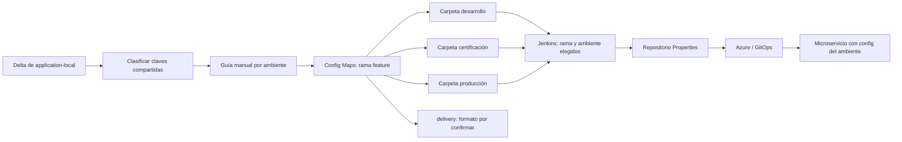

# Recorrido confirmado y alcance del MVP

El usuario confirmó este modelo:

Jenkins toma únicamente la carpeta del ambiente seleccionado de esa rama y la
traslada a Properties. Los YAML apuntan a APIs distintas por ambiente. La
estructura exacta, nombres de archivos, contenido de delivery, Groovys y enlace
Azure/GitOps se confirmarán antes de automatizar esta parte.

En MVP el agente prepara delta y checklist, sin editar repos externos ni jobs.
Conservar nombres con acentos o sin ellos tal como existan: no inventar ruta.
`application-local` puede contener mock URLs, credenciales o switches de pruebas;
clasificarlos antes de trasladar. ConfigMaps no son almacén de secretos.

Una actualización local no exige por sí sola YAML externos. Cambios de código
pueden no cambiar claves; a la inversa, una clave nueva compartida necesita
handoff aunque local aún use placeholders. Registrar ambos casos con evidencia.

En el pase manual registrar SHA de Config Maps, ambiente/job, SHA destino de
Properties, release/imagen y verificación de carga efectiva. Job verde no prueba
que el servicio recibió o recargó esos valores. Dev valida promoción y rollback.
